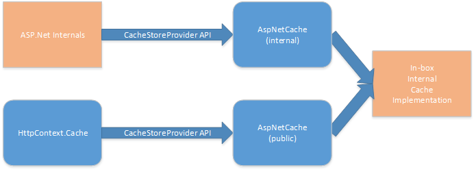

# Cache Extensibility in ASP.Net 4.7

## Introduction

In the 4.7 release of the .Net Framework, ASP.Net has made some significant – and mostly unnoticeable – changes to memory management and the object cache. In previous releases, all memory and cache management was handled internally, and there was no separation of concern between the two. The code for managing the object cache and handling memory pressure was comingled everywhere. In this release, a significant effort was put in to separating these concerns. You can now think of a model with three logical components.
1)	The Object Cache Store. It adds/updates/deletes cache items, and trims when asked. The internal cache is just a bag of expiring objects now. It no longer plays any direct role in memory management.
2)	The Memory Monitor. It is responsible for defining thresholds and monitoring memory use against those thresholds, and notifying interested parties when thresholds are crossed.
3)	Reactions to notifications from the memory monitor. Trimming the cache. Disposing superfluous native components. Inducing GC.

For details on the memory management parts (2 and 3) [look here](MemoryManagement.md). This post will focus on what’s new with the object cache.

## What’s New in 4.7?

In the box, ASP.Net is still shipping with the same underlying internal cache implementation that has been there for several releases. You shouldn’t see any change in your applications behavior by default. What is different is that you can now plug different cache implementations in to ASP.Net to replace the default object cache. Most existing apps won’t have a good reason to do this, as the default cache implementation is generally sufficient.

Since the very first release of ASP.Net, applications have been able to take advantage of [`HttpContext.Cache`](https://msdn.microsoft.com/en-us/library/system.web.httpcontext.cache(v=vs.110).aspx) to cache data to improve performance. Internally, ASP.Net uses the same underlying cache for compilation, configuration, and output caching to name a few. To give applications the ability to completely swap out the default cache implementation ASP.Net needs to offer a design that meet the needs of the [`HttpContext.Cache`](https://msdn.microsoft.com/en-us/library/system.web.httpcontext.cache(v=vs.110).aspx) API, as well as the behind the scenes internal uses mentioned before. That’s where [`CacheStoreProvider`](https://msdn.microsoft.com/en-us/library/system.web.caching.cachestoreprovider(v=vs.110).aspx) comes in.

As mentioned previously, ASP.Net makes liberal use of the object cache internally. This use is generally not exposed to developers because the items are inserted into the object cache with a special “internal” designation. With this refactoring of the cache implementation, it was a goal to keep internal items separate from normal cache use, as well as to keep the interface simple. To accomplish this goal, ASP.Net now uses two logically separate cache instances per application. As you can see in this diagram of the default wire-up, default caches in the box are still backed by a single instance, with two shims forwarding into it. But that’s an implementation detail that resulted from wanting to disturb as little of the pre-existing behavior as possible. Out-of-box cache implementations can keep things simple with two separate instances.



## How do I use this?

Most applications will be happiest with the default implementation. It has performed admirably for many years. But if an application has a specific reason to use a different cache implementation, there are two steps that need to be taken. First, a new cache implementation is required. Second, that new implementation needs to be configured for the application.

### Implement Your Own Object Cache

Creating your own cache implementation is as simple as implementing the [`System.Web.Caching.CacheStoreProvider`](https://msdn.microsoft.com/en-us/library/system.web.caching.cachestoreprovider(v=vs.110).aspx) abstract base class. This class defines a simple API that ASP.Net can use to utilize a cache, and includes not just basic add/insert/remove/trim methods, but also simple methods for managing [`CacheDependency`](https://msdn.microsoft.com/en-us/library/system.web.caching.cachedependency(v=vs.110).aspx)’s. The new class [`CacheInsertOptions`](https://msdn.microsoft.com/en-us/library/system.web.caching.cacheinsertoptions(v=vs.110).aspx) is introduced in this API to cut down on the number of overloads and to help keep default parameters consistent. While the actual implementation of a fast and efficient cache is not a simple exercise, conforming to this base class is. 

Consider an existing alternative object cache implementation of your choice. This example uses the well-known [`MemoryCache`](https://msdn.microsoft.com/en-us/library/ms228248(v=vs.100).aspx) that ships in the framework. Wrapping this existing cache implementation is relatively straightforward. It can be done in less than 200 lines of code, as you can see in [this sample](../src/MemoryCacheProvider/MemoryCacheProvider.cs). 

### Using a Different Cache

Substituting a different cache for your application is even more straightforward and is accomplished through the configuration system. You might have noticed that the base class for new cache implementations carries the term [Provider](https://msdn.microsoft.com/en-us/library/aa479020.aspx). New cache implementations can be configured and wired up just like any of the other [provider-based](https://msdn.microsoft.com/en-us/library/aa479020.aspx) features of ASP.Net. This is what a simple web.config for the `MemoryCache` example above would look like:

< :exclamation: > Here's the catch. ASP.Net uses the cache as such an integral part of operations that
it gets loaded before just about every internal system there is. The application hasn't even been
configured to use the `/bin` directory yet. So ASP.Net won't even find the new cache implementation
there. <ins>**It must exist in the GAC for ASP.Net to use it.**</ins> </ :exclamation:>

```xml
<configuration>
  <system.web>
    <caching>
      <cache defaultProvider="MemoryCacheSample">
        <providers>
          <add name="MemoryCacheSample" type="CacheInstrumentation.MemoryCacheProvider.MemoryCacheProvider, CacheInstrumentation, Version=1.0.0.0, Culture=neutral, PublicKeyToken=31bf3856ad364e35" />
        </providers>
      </cache>
    </caching>
  </system.web>
</configuration>
```

## Summary

ASP.Net introduced some cache/memory management housekeeping with new extension points in 4.7. While applications are free to create and utilize their own object cache implementations, ASP.Net comes pre-wired to use the same internal implementations as before. Creating a new cache implementation is as simple as implementing the [`System.Web.Caching.CacheStoreProvider`](https://msdn.microsoft.com/en-us/library/system.web.caching.cachestoreprovider(v=vs.110).aspx) abstract base class. Using a non-default cache implementation is accomplished via the [`cache` configuration section](https://msdn.microsoft.com/en-us/library/ms228248(v=vs.100).aspx) in web.config. Currently the only object cache provider offered in the box by ASP.Net is a thin internal wrapper around the old internal cache implementation that has been used for several releases.
