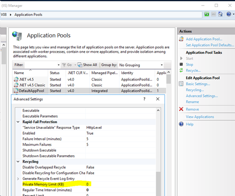
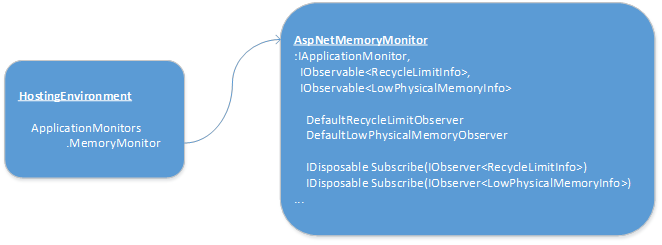

# Memory Management in ASP.Net 4.7

## Introduction

ASP.Net in 4.7 has made a few changes to how memory management is handled to allow developers to take more control over the process. Throughout its existence, ASP.Net has tried to “do the right thing” in terms of managing memory in the worker process. There have been tweaks to the internal mechanisms over the years, finally settling down to the set of mechanisms that have been in place since .Net 4.0. However, balancing the needs and challenges of memory management for a multitude of different workloads can be difficult, particularly when you consider that different web applications are allowed to share the same process resources in ASP.Net’s multi-tenant model. And this is before considering additional workloads running in other processes on the same machine. ASP.Net has tried to accommodate the needs of common and recommended scenarios, and has even provided a few knobs and buttons to help adjust behavior… but sometimes the mechanisms in the box fall short.

As a starting point, consider what ASP.Net is really concerned about when managing memory. Ideally, all requests and the associated objects that support them are small, short-lived, and handled easily by the CLR’s finely tuned GC system. Realistically, this is not always the case – particularly when long-lived objects (e.g., cached objects and session state items) can be created easily and are often encouraged to improve application performance. Performance always comes with trade-offs though. In this case, more complex memory usage patterns. The design of the in-box mechanisms for handing “memory pressure” are clearly focused on two primary objectives.
1)	Keep the built-in object cache (and [`MemoryCache`](https://msdn.microsoft.com/en-us/library/system.runtime.caching.memorycache(v=vs.110).aspx) as well) under control so it does not push the process memory footprint beyond configured limits.
2)	Avoid too frequent and unnecessary GC’s that could hurt throughput.

How does ASP.Net address these needs? If you were to examine the source code prior to .Net 4.7, the approach might be somewhat confusing, as memory management and cache management code were comingled everywhere. Complicating things further is the fact that some monitoring is done from the default app domain, and some is done in individual application domains, with potentially different effects at occurring at different times for different web applications sharing the same worker process. Much of the code has been grown and contorted since .Net 1.0 and was heavily influenced by the single application bias that ASP.Net had in that initial release.

Here is a brief primer on how ASP.Net has handled cache and memory management in 4.5 through today. ASP.Net establishes two limits and attempts to keep host processes within those limits using various monitoring mechanisms. Here, these limits will be referred to by names that make sense. If you browse the old source code, you’ll notice that internally, these limits have been referred to with all sorts of unhelpful, falsely-descriptive terms.

## Process Recycling Limit

As the name suggests, this limit is supposed to represent the threshold at which the host process will recycle[^1].  ASP.Net keeps a timer in the default app domain to monitor this limit. Under “normal” conditions, the timer will fire once every 120 seconds. When “pressure” is detected, the timer will fire every 30 seconds, or even 5 seconds in high pressure situations. What ASP.Net considers “normal”, “medium”, or “high” pressure for this limit is variable. ASP.Net tries to be smart about allowing maximum memory use and will adjust these pressure marks based on previous pressure readings and their relative volatility. At process start, the pressure levels are set like this:

| Pressure Level | Defined As Usage Above...                                |
|----------------|----------------------------------------------------------|
| High           | Max(90% Recycle Limit, Recycle Limit – (20MB * #CPUs))   |
| Medium         | Roughly splits the difference                            |
| Low            | Max(60% Recycle Limit, Recycle Limit – (480MB * #CPUs))  |

Every time the “Process Recycling Limit” timer fires, ASP.Net reads current private bytes usage for the process, and update various internal data, including the definition of those pressure marks. No actions are taken unless the current reading exceeds the current definition of “high” pressure. If that is the case, then this thread in the default app domain will make a choice. Initially, it will ask caches in all application domains to trim 10% of their items, and then perform a GC. If the “high” pressure condition still exists the next time the timer fires, the thread will ask to trim 20% of cache items. Then 30%, 40%, up to a maximum of 50%. Once that 50% level is reached, the monitor tries to be smart about not inducing too many GC’s, and will request cache trimming at a rate that crudely tries to target total time in GC under 3.3% and less than once per 5 seconds.

None of this is configurable, except for the actual recycling limit for the worker process.



[^1]: If you have configured a limit with IIS, ASP.Net will lookup that limit. If you have not, ASP.Net will set the limit at 60% of the total physical memory on the machine at a minimum, not to exceed 800MB on a 32-bit machine (1800MB if booted with /3G) or 1TB on a 64-bit machine.
 
## Low Memory Limit

The second limit that ASP.Net monitors is the “Low Memory Limit.” This limit is an attempt by ASP.Net to be a good citizen on the host machine, and be more prudent with memory usage when total available memory on the machine is low. The “pressure” limits in this case are expressed as a percentage of physical memory in use by all processes on the host machine. There is a “low” pressure threshold, and a “high” pressure threshold. By default, “high” pressure is set as a percentage of the total size of physical memory.
Physical Memory	“High” Threshold

| Physical Memory | "High" Threshold |
|-----------------|------------------|
| >= 4GB          | 99%              |
| >=2GB           | 98%              |
| >=1GB           | 97%              |
| >=768MB         | 96%              |
| <768MB          | 95%              |

The “low” pressure threshold is set at 9% less. The “high” pressure threshold can be configured via the [`percentagePhysicalMemoryUsedLimit`](https://msdn.microsoft.com/en-us/library/system.web.configuration.cachesection.percentagephysicalmemoryusedlimit.aspx) configuration attribute, somewhat confusingly located on the [`system.web/cache`](https://msdn.microsoft.com/en-us/library/ms228248(v=vs.100).aspx) configuration section. The “low” threshold is still set relative to the configured “high” threshold.

For this limit, ASP.Net creates an timer in each individual application domain. When the pressure level is above the “high” threshold, the timer will fire every 5 seconds. If the pressure level is over half of the “low” threshold, the timer will fire every 30 seconds. Below that, the firing interval is read from the not-quite-accurately-named [`privateBytesPollTime`](https://msdn.microsoft.com/en-us/library/system.web.configuration.cachesection.privatebytespolltime(v=vs.110).aspx) configuration attribute, also located on the [`system.web/cache`](https://msdn.microsoft.com/en-us/library/ms228248(v=vs.100).aspx) configuration section. The default is 2 minutes.

As with the “Process Recycling Limit”, ASP.Net will only take action if conditions exceed the “high” pressure threshold. When that is the case, ASP.Net will trim between 10% and 50% of items from just the caches belonging to the single application, (remember each application has its own timer for this limit,) and only if a Gen2 GC has taken place since the last time the timer observed “high” pressure. Notably, no explicit call to force a GC is made when handling this type of pressure.

## What’s New in 4.7?

A significant effort was put in to separating concerns between cache and memory management code. You can now think of a model with three logical components.
1)	The Object Cache Store. It adds/updates/deletes cache items, and trims when asked. The internal cache is just a bag of expiring objects now. It no longer plays any direct role in memory management. ([Look here](#CacheStoreProvider.md) for details on the cache side of things.)
2)	The Memory Monitor. It is responsible for defining thresholds and monitoring memory use against those thresholds, and notifying interested parties when thresholds are crossed.
3)	Reactions to notifications from the memory monitor. Trimming the cache. Disposing superfluous native components. Inducing GC.

ASP.Net by default wires up a story using these three logical components so that cache and memory management still behave as they always have[^2], and existing applications shouldn’t notice any difference. Here’s how it all fits together.



##### ApplicationMonitors:
New in 4.7 is the concept of ApplicationMonitors – a collection of monitors that ASP.Net relies on for process and application management – accessible via [`HostingEnvironment.ApplicationMonitors`](https://msdn.microsoft.com/en-us/library/system.web.hosting.hostingenvironment.applicationmonitors(v=vs.110).aspx). Currently, there is only one monitor – [`MemoryMonitor`](https://msdn.microsoft.com/en-us/library/system.web.hosting.applicationmonitors.memorymonitor(v=vs.110).aspx). This monitor is of course responsible for monitoring memory use in the application. Developers are free to write their own memory monitor that implements [`IApplicationMonitor`](https://msdn.microsoft.com/en-us/library/system.web.hosting.iapplicationmonitor(v=vs.110).aspx) to replace the default if the default is not meeting their needs. Speaking of which…

##### AspNetMemoryMonitor:
This is the in-box memory monitor that gets wired up by default. This class monitors the two limits discussed above – the process recycling limit and the low physical memory limit. Every application will have their own instance of [`AspNetMemoryMonitor`](https://msdn.microsoft.com/en-us/library/system.web.hosting.aspnetmemorymonitor(v=vs.110).aspx) available via [`HostingEnvironment.ApplicationMonitors.MemoryMonitor`](https://msdn.microsoft.com/en-us/library/system.web.hosting.applicationmonitors.memorymonitor(v=vs.110).aspx). Thus, monitoring the “Low Memory Limit” separately in each app domain translates naturally to this new monitor. However, to maintain functional equivalence with previous releases, the “Process Recycling Limit” monitoring is magically connected to a singleton that lives in the default app domain. Thus the recycling threshold is monitored from there once for all app domains. All timer intervals and thresholds are determined and configured the same as before. This monitor is solely responsible for monitoring though. It only notifies of memory pressure. It does not manage or react to it. To do that, it allows you to subscribe a pair of observers to handle the “high” pressure conditions for each limit using the [`IObservable<>`](https://msdn.microsoft.com/en-us/library/dd990377(v=vs.110).aspx) pattern.

##### IObserver<RecycleLimitInfo>:
The default subscriber for the “Process Recycling Limit” is [`RecycleLimitObserver`](https://msdn.microsoft.com/en-us/library/system.web.hosting.recyclelimitobserver(v=vs.110).aspx). It will trim the cache in each domain as was the case before, and return an indication as to whether a GC would be useful after trimming. (The magic singleton in the default app domain will take returning indicators from all app domains into account and perform the same due diligence in keeping total time in GC under 3.3%/once per 5 seconds.) To replace the default recycle limit observer, you can set your own on [`AspNetMemoryMonitor.DefaultRecycleLimitObserver`](https://msdn.microsoft.com/en-us/library/system.web.hosting.aspnetmemorymonitor.defaultrecyclelimitobserver(v=vs.110).aspx). You can also subscribe additional observers via the [`AspNetMemoryMonitor.Subscribe()`](https://msdn.microsoft.com/en-us/library/mt775049(v=vs.110).aspx) method.

##### IObserver<LowPhysicalMemoryInfo>:
The default subscriber for the “Low Memory Limit” is [`LowPhysicalMemoryObserver`](https://msdn.microsoft.com/en-us/library/system.web.hosting.lowphysicalmemoryobserver(v=vs.110).aspx). It also trims the cache as before and will always return an indication that no GC is necessary. To replace the default low physical memory observer, you can set your own on [`AspNetMemoryMonitor.DefaultLowPhysicalMemoryObserver`](https://msdn.microsoft.com/en-us/library/system.web.hosting.aspnetmemorymonitor.defaultlowphysicalmemoryobserver(v=vs.110).aspx). You can also subscribe additional observers via the [`AspNetMemoryMonitor.Subscribe()`](https://msdn.microsoft.com/en-us/library/mt775070(v=vs.110).aspx) method.

[^2]: One regression was introduced with Cache.Insert, fixed in a hotfix in 4.7 and also going forward with 4.7.1 - https://support.microsoft.com/en-us/help/4035412

## How is this useful?

Let’s dig into a few scenarios where ASP.Net’s default memory management might come up short, and how the new API’s can be leveraged to alleviate these issues in ASP.Net 4.7.But first – <ins>***Disclaimer: Any code presented here is for illustrative purposes only. It is not production ready. It is intentionally simple and does not comprehensively address complete end-to-end scenarios that are likely to be seen in the real world.***</ins>

#### Managing Private Resources
Suppose your application manages a large set of native resources, or private data, that is invisible to ASP.Net. When approaching the Recycle Limit, ASP.Net only knows about the built in cache, (and [MemoryCache](https://msdn.microsoft.com/en-us/library/system.runtime.caching.memorycache(v=vs.110).aspx) caches via behind the scenes magic,) so that is the only place it can turn to try and tidy things up to avoid an expensive recycle. But you know your application better, and know that there could be other more effective ways to avoid a recycle. The simple solution here is to add an observer for the Recycling Limit to trim your private resources in addition to the cache trimming that ASP.Net does by default.

```C#
using System;
using System.Web.Hosting;
namespace Microsoft.AspNet.Samples.MemoryManagementSample
{
    public class PrivateResourceTrimmer : IObserver<RecycleLimitInfo>
    {
        public void OnCompleted() { }
        public void OnError(Exception error) { }
        public void OnNext(RecycleLimitInfo value)
        {
            // Trim my private resources.
            myPrivateResources.Trim();

            // The default memory monitor in ASP.Net already attempts to limit the frequency of this event
            // such that calls to GC are not overwhelming. However, tracking the effectiveness of your private
            // resource trims, and adjusting your reaction based on ‘value.TrimFrequency’ is highly recommended.
            value.RequestGC = true;
        }
    }
}
```

```C#
using System;
using System.Web;
using System.Web.Hosting;
using Microsoft.AspNet.Samples.MemoryManagementSample;
namespace MyWebApp
{
    public class Global : HttpApplication
    {
        void Application_Start(object sender, EventArgs e)
        {
            IObservable<RecycleLimitInfo> mm = (IObservable<RecycleLimitInfo>)HostingEnvironment.ApplicationMonitors.MemoryMonitor;
            IObserver<RecycleLimitInfo> observer = new PrivateResourceTrimmer();
            Application.Add("privateResourceUnsubscriber", mm.Subscribe(observer));
        }
    }
}
```

#### Avoiding Spurious Recycles

The default recycling monitor in ASP.Net tries to be super smart about maximizing memory use right up to the configured recycling limit, while minimizing the effect trimming and GC have on throughput. It keeps track of things like past private bytes readings and the average delta, and tries to let you get as close to the limit as you can without going over. But playing chicken with the recycling limit inevitably results in the occasional step over the line, particularly in inconsistent workloads, or workloads that deal with large data sets. Any tiny little temporary spike at the wrong time could trigger an unnecessary process recycle. This case requires a little more effort, but it is possible to write your own custom recycle monitor that generates notifications more proactively.

Note: Again, this is over-simplified sample code. This sample is not thread-safe, and it does not implement [IObservable](https://msdn.microsoft.com/en-us/library/dd990377(v=vs.110).aspx)<[LowPhysicalMemoryInfo](https://msdn.microsoft.com/en-us/library/system.web.hosting.lowphysicalmemoryinfo(v=vs.110).aspx)>. ASP.Net can still use a monitor that does not implement both IObservables, but your application will no longer be monitoring the Low Memory Limit if it only implements one like this.

```C#
using System;
using System.Collections.Generic;
using System.Diagnostics;
using System.Threading;
using System.Web.Hosting;
namespace Microsoft.AspNet.Samples.MemoryManagementSample
{
    public class CustomRecycleLimitMonitor : IApplicationMonitor, IObservable<RecycleLimitInfo>
    {
        const int THIRTY_SECONDS = 30 * 1000;
        const long HALF_GB = 0x20000000;
        private List<IObserver<RecycleLimitInfo>> _observers = new List<IObserver<RecycleLimitInfo>>();
        private Timer _simpleTimer;
        public void Start()
        {
            if (_simpleTimer == null)
                _simpleTimer = new Timer(CheckPrivateBytesUsage, this, THIRTY_SECONDS, THIRTY_SECONDS);
            else
                _simpleTimer.Change(THIRTY_SECONDS, THIRTY_SECONDS);
        }
        public void Stop()
        {
            _simpleTimer.Change(Timeout.Infinite, Timeout.Infinite);
        }
        public void Dispose() {
            Stop();
            _simpleTimer.Dispose();
        }
        public IDisposable Subscribe(IObserver<RecycleLimitInfo> observer)
        {
            _observers.Add(observer);
            return new Unsubscriber(() => { _observers.Remove(observer); });
        }
        private static void CheckPrivateBytesUsage(object state)
        {
            CustomRecycleLimitMonitor monitor = (CustomRecycleLimitMonitor)state;
            long currentPB = Process.GetCurrentProcess().PrivateMemorySize64;
            // Try to stay under a laughable 512MB. Note that this over-simple code is not guarding against
            // too frequent GC’s, or calling GC from every app domain that loads this code instead of coordinating
            // between them.
            if (currentPB > HALF_GB) {
                if (monitor.RaiseRecycleLimitEvent(new RecycleLimitInfo(currentPB, HALF_GB, RecycleLimitNotificationFrequency.Medium)))
                    GC.Collect();
            }
        }
        internal bool RaiseRecycleLimitEvent(RecycleLimitInfo info)
        {
            foreach (IObserver<RecycleLimitInfo> obs in _observers) {
                try {
                    obs.OnNext(info);
                }
                catch (Exception) {
                    // Unhandled Exceptions here will likely crash the process
                }
            }
            return info.RequestGC;
        }
        class Unsubscriber : IDisposable
        {
            Action _unsub;
            public Unsubscriber(Action unsubscribeAction) {
                _unsub = unsubscribeAction;
            }
            public void Dispose() {
                _unsub.Invoke();
            }
        }
    }
}
```

```C#
using System;
using System.Web;
using System.Web.Hosting;
using Microsoft.AspNet.Samples.MemoryManagementSample;
namespace MyWebApp
{
    public class Global : HttpApplication
    {
        void Application_Start(object sender, EventArgs e)
        {
            AspNetMemoryMonitor aspnet_mm = (AspNetMemoryMonitor)HostingEnvironment.ApplicationMonitors.MemoryMonitor;
            CustomRecycleLimitMonitor custom_mm = new CustomRecycleLimitMonitor();
            Application.Add("recycleUnsubscriber", custom_mm.Subscribe(aspnet_mm.DefaultRecycleLimitObserver));
            HostingEnvironment.ApplicationMonitors.MemoryMonitor = custom_mm;
        }
    }
}
```

## Summary

Previous versions of ASP.Net have shipped with a complicated internal mechanism for monitoring and managing memory use, and this system has evolved over time to adjust to changes in the CLR, hardware trends, and recommended usage patterns for ASP.Net. Though the default system does an admirable job of handling most situations, it is rarely the case that “one size fits all.” ASP.Net 4.7 exposes new ways to take control of memory management to custom fit your application, while leaving the default mechanisms in place for those who don’t need the greater control.
